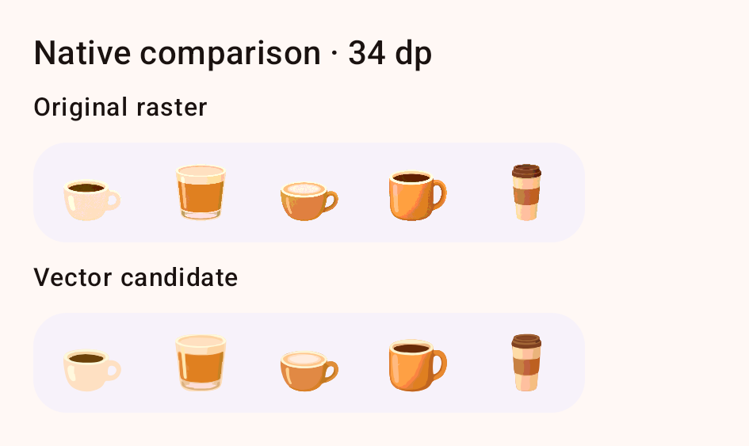

# Cup icon vector study — 2 October 2026

Five source-derived SVG and Android VectorDrawable candidates preserve the
calculator vessels' warm illustrated style while replacing fine grain with
smooth color regions. This is a reviewable experiment; the app continues to
use its original PNG resources.



## Artwork and provenance

The original 256 × 256 transparent canvases, vessel proportions, open handles,
elliptical cream rims and asymmetrical warm shading are retained. The cortado
keeps its clear glass foot, the cappuccino keeps pale foam, and the travel cup
keeps its layered brown lid and sleeve.

Astra used VTracer on simplified colors from the original PNGs. Eight small
paths are explicitly reconstructed against the source pixels: the cortado's
glass reflection, the cappuccino's curved reflection, and six travel-lid
details. These are authored details, not claimed as automatic tracing.
Image generation was unnecessary for this conversion. All deliverables contain
actual path geometry with transparent backgrounds; no bitmap is embedded.

- [SVG artwork](svg/)
- [Android vectors](android/)
- [Toolbar comparison](toolbar-comparison.png): original above, vector below.
- [34 px, 89 px and 256 px comparison](comparison.png).
- [Native dark-theme comparison](native-dark-34dp.png).
- [Source/output hashes and complexity](report.json).

The five SVGs total 22,946 bytes and the Android XML files total 26,040 bytes,
compared with 25,661 bytes for the original PNGs. This is primarily a scaling
and editability improvement, rather than a significant file-size reduction.
Individual candidates use 5–16 paths and 5–14 colors.

## Reproduce the conversion

From the repository root, with ImageMagick available on PATH:

```powershell
uv run --with vtracer==1.0.0a3 --with pillow==12.3.0 --with numpy==2.3.5 python tools/vectorize_vessel_icons.py
```

Windows Segoe UI supplies comparison-sheet labels. An already cached toolchain
can use `uv run --offline` with the same dependencies. Original PNG files are
read-only inputs. The converter writes SVGs, Android XML, comparisons and the
hash report in this study directory; intermediate files stay in `build/`.

## Native verification

Two Compose cases passed on the Android 16/API 36 x86_64 emulator at 420 dpi.
They render original PNGs and untinted VectorDrawables with identical complete
canvases at 34 dp and 96 dp in light and dark themes, asserting the exact image
bounds. The small icons occupy the same 48 dp cells used by the calculator.
A separate Astra review approved all four native comparison sheets: handles,
glass, foam and lid details remain clear without clipping or dark fringes.

The opt-in harness keeps experiment resources and tests out of ordinary builds:

```powershell
./gradlew.bat :app:assembleDebug :app:assembleDebugAndroidTest -I tools/vessel_vector_study/native.init.gradle --no-daemon --console=plain
```

After claiming an emulator through the Android MCP, install the resulting
app/test APKs and run `com.adsamcik.starlitcoffee.ui.component.VesselVectorStudyTest`
with `androidx.test.runner.AndroidJUnitRunner`. Its disposable app ID is
`com.adsamcik.starlitcoffee.vesselvectorstudy`. Captures save below that app's
external files directory in `vessel-vector-study/`.

The complete local native captures are retained in
`.qa-screens/vessel-vector-study/native-captures/`; build and instrumentation
logs remain in `build/vessel-vector-study/`. Appearance and resource rendering
are verified here; device rendering performance was not benchmarked.
