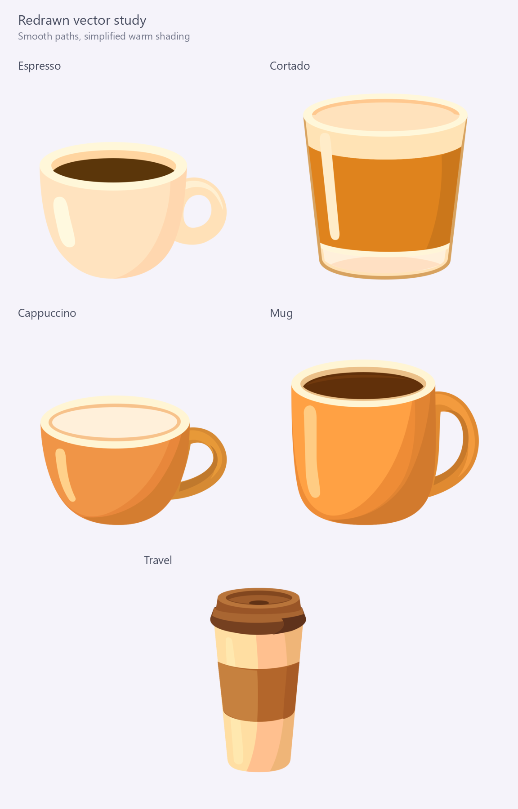

# Hand-drawn cup vectors

This second study replaces the rejected automatic traces with deliberate
Bezier silhouettes, coherent rim curves and broad warm shading. The original
256px canvas and distinct vessel proportions guide each drawing. The app
continues to use its original PNG resources; these are review candidates.



- [89px comparison](comparison-89px.png), equivalent to 34dp at 420dpi.
- [34px comparison](comparison-34px.png).
- [Editable SVGs](svg/) and matching [Android VectorDrawables](android/).
- [Source/output hashes](report.json).

## Art direction and provenance

Astra critiqued the first trace and produced the raster illustration in
[reference/](reference/) with imagegen. That reference informs the smooth
sweeping shadows and highlights. Its proportion drift, transparency fringes,
coffee glare and foam flecks are not copied into the vectors.

Astra's vector-authoring run failed with a model-capacity error. Codex then
hand-authored the actual SVG paths using Astra's direction and the original
artwork, with a further Astra review of the enlarged and small previews.
There is no automatic tracing or embedded bitmap in the new SVG/XML files.
The generated illustration is a reference only, not a vector deliverable.

## Reproduce exports and previews

The committed SVGs are the editable source artwork. The renderer reads them
without modifying them and exports the same path data, fills and winding rules
into Android XML. ImageMagick renders directly from the SVGs; large previews
are not upscaled raster icons. Individual 1024px transparent renders are saved
in `build/vessel-vector-study/refined/`.

```powershell
uv run --offline --with pillow==12.3.0 python tools/render_vessel_vector_study.py
```

Pillow builds the comparison sheets, using Windows Segoe UI for labels.
ImageMagick must be on PATH or at its installed Windows path in the script.

## Validation boundary

Review includes the full set at 512px and comparisons at 89px and 34px.
The further Astra review found the handle join, shadow cusp, heavy shading
and concentric foam defects resolved, with no remaining actionable preview
issues. This is an artwork assessment, not user acceptance.
The SVGs and Android exports contain only solid-filled paths; compound handle
paths preserve transparent openings with their winding directions. Original
PNG hashes match the first study.

All five Android XML files compiled successfully using AAPT2 2.20-15978811
(the current AGP 9.4.1 tool). This checks resource compilation, not native
appearance or performance. No app resources or production mappings changed.

The existing opt-in native harness can select this revision:

```powershell
./gradlew.bat :app:assembleDebug :app:assembleDebugAndroidTest -I tools/vessel_vector_study/native.init.gradle -PvesselVectorStudyRevision=refined --no-daemon --console=plain
```

The native screenshots in the parent study belong to the initial traced
revision. They do not establish native appearance for these new drawings.
