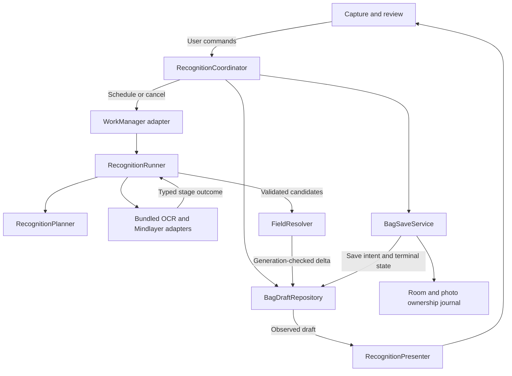

# Seamless coffee-label recognition

**Status:** implementation-ready design; application changes are not implemented.
**Date:** 2026-09-17. **Reviewed baseline:** `399fe1e`.

This design consolidates the [integration audit](../evaluations/2026-09-17-ai-integration.md)
and [user-flow recommendation](../evaluations/2026-09-17-label-recognition-user-experience.md).
It extends [ADR 0004](../adr/0004-user-owned-label-recognition-drafts.md).

## Product contract

**Take a photo, review useful details, save the coffee.**

Recognition should feel like assistance built into the form. The user can finish
without understanding OCR, models, stages, sessions, or background jobs. Keep
Starlit Coffee's native Android / Material 3 identity. Apply the requested design
discipline through responsiveness, restraint, stable interactions, and recovery.

Three rules govern every decision:

1. The user's draft remains useful when recognition degrades.
2. Uncertainty remains uncertainty; completion never requires invented facts.
3. Saving succeeds only when the reviewed values are durably saved.

The product has one capture/review flow for manual, assisted, and returning users.
Provider configuration belongs in a contextual setup sheet and existing settings.
No new recognition modes, confidence sliders, stage controls, or permanent retry
toolbar are needed.

## The experience

### Capture

- One primary action: take a photo. Gallery is the secondary alternative.
- Show a brief, actionable capture hint only for an observable issue: reflection,
  darkness, motion, or framing. A quality hint never traps the user in the camera.
- Stage the photo privately and create its draft before reporting that it is kept.
- Open review after the first capture. "Add photo" is available beside the photo;
  another side is optional and stays in the same draft.
- Camera permission refusal leads to gallery/manual entry, not a dead end.
- Import failure offers retry or another photo. Do not silently drop a selected
  photo or imply that it has been retained.

### Review

The stable layout contains a compact photo preview, coffee name and roaster,
useful recognized details, an expandable "More details" section, and the Save
action in the normal bottom action area. Name is the only required identity
field. Weight remains optional; supplied values must satisfy existing validation.

Show one compact status region above the fields. Reserve modest space so updates
do not shift the user's current input. Use real state, without a stage percentage
or estimated time that the system cannot support:

| State | Presentation | Action |
| --- | --- | --- |
| Initial recognition | "Reading the label…" with a quiet activity indicator | Editing available; Save available once valid |
| Useful draft, further work | "Checking a few more details…" | Save remains primary |
| Ready, no meaningful conflicts | Remove recognition status | Save |
| A material conflicting suggestion | "Check 1 detail" | Reveal that field and its photo evidence |
| Stopped with usable partial results | Usually no alert; if an explicitly requested improvement failed, "Couldn't read more details." | Contextual "Try again" when the cause is retryable |
| No usable fields | "Couldn't read this label. You can enter the details." | Enter name; photo-specific recovery when relevant |
| Save failed | "Couldn't save this coffee. Try again." | Retry save; keep the exact form and photos |

Keep fields editable while recognition runs. Autofill empty, untouched fields
only with evidence that passes the acceptance policy. Once a nonempty value has
been presented, material replacements become suggestions. Identical/canonical
equivalents may update internal attribution without a visible change. A cleared
field is an explicit user edit and must stay cleared.

Unknown optional fields do not count as errors or "details to review". A conflict
is shown at the relevant field, with the existing value and one alternative at a
time. "Use this" and "Keep mine" resolve it. Do not expose numeric confidence.
The source image can be enlarged without losing keyboard, scroll, or field state.

Before Save, valid automatic values are ordinary editable draft values. Weak or
conflicting candidates remain suggestions outside the saved value. Saving does
not silently accept every unresolved suggestion and does not force a checklist
for all recognized fields.

### Leave, return, save

- Back keeps an active draft and returns to inventory. Show a brief "Draft kept"
  acknowledgement only after its pending writes succeed. Inventory uses the
  existing draft card; tapping it returns to the exact draft and review position.
- Discard is a secondary overflow action with confirmation because it deletes
  unsaved work. It closes the generation before cleanup. Back never discards.
- Save flushes edits, freezes the reviewed snapshot, stops optional work, and
  shows "Saving…" only while persistence is in progress. Navigation completes
  after the saved bag and photo ownership are verified.
- Saved values never change from late recognition. Further scanning of a saved
  bag is an explicit rescan with reviewable differences.
- Photo/DB save failure leaves the draft intact. Thumbnail generation failure may
  use the original retained photo. Loss of the original photo is never silently
  hidden; "Save without photo" is a deliberate recovery only when needed.
- If the app dies after DB commit, restoration recognizes the saved bag by the
  existing unique scan-session key and completes cleanup; it does not duplicate it.

### Setup and background behavior

Bundled recognition always works independently of optional enrichment. If
Mindlayer is already enabled and ready, use it without an extra tap. If setup is
needed and could help a poor result, show one optional contextual offer after
baseline recognition. Identify Mindlayer honestly inside setup, including its
on-device processing boundary. Do not repeatedly prompt after dismissal; respect
the existing explicit opt-out. Disabling enhancement must not disable bundled OCR.

Keep network lookup permissions and QR approval separate from local recognition.
The planner cannot broaden consent, silently choose another provider, or upload
photos. Existing barcode lookup policy stays unchanged until separately reviewed.

Leaving review preserves and may finish the already-started, bounded recognition
attempt. It does not grant an unlimited background search. Longer enrichment is
an explicit "Look for more details" action on the draft. Use the existing Android
foreground-work notification while required by the platform; no modal permission
detour just to review/save. Completion is quiet in the foreground. A background
completion notification, when permitted and appropriate, deep-links to the draft,
appears once, and is suppressed if the user already returned, saved, or discarded.
Denied notification permission must not make the draft inaccessible.

## One state owner, seven small responsibilities

Keep the existing atomic draft storage, Room coffee database, WorkManager,
photo-ownership journal, and shared Mindlayer client. No wholesale persistence
rewrite, generic workflow framework, event-sourcing system, or new Android service
is needed. The following are logical classes/packages within the existing app.

| Boundary | Sole responsibility | Existing implementation to evolve |
| --- | --- | --- |
| `BagDraftRepository` | Durable draft revisions, serialized mutations, observation and atomic compare/update | Wrap `BagDraftStore`; retain atomic files and tombstones |
| `RecognitionCoordinator` | User commands, scheduling, ownership and Save/Discard barriers | Move scan lifecycle responsibilities out of `BrewViewModel` and duplicate Compose callbacks |
| `RecognitionPlanner` | Pure next-step decision from evidence, capabilities, budget and completed work | Replace the fixed plan in `BagPhotoExtractor` and consolidate `BagVisionPlanner` |
| `RecognitionRunner` | Execute one plan, checkpoint outcomes, enforce cancellation and resource limits | Extract orchestration from `BagPhotoExtractor`; worker becomes a thin adapter |
| `FieldResolver` | Validate, normalize, preserve provenance and merge candidates deterministically | Evolve `BagPhotoScanSupport`, parser and field context mapping |
| `BagSaveService` | Freeze, persist and reconcile one reviewed snapshot | Move `persistScannedBag` and rescan recovery out of UI / `BrewViewModel` coupling |
| `RecognitionPresenter` | Derive copy, one contextual recovery action and accessible announcements | Consolidate `RecognitionUiStateMapper` and duplicated `GuidedScanFlow` inference |

Provider adapters remain implementation details under the runner, with typed
results. ViewModels only expose repository state and dispatch commands. A worker
and a foreground/test runner use the same runner and resolver. No separate
production algorithm in `BrewViewModel`, no UI-owned result merging, and no
benchmark-specific reconstruction of the pipeline.

## State and concurrency contract

Keep draft lifecycle, recognition execution, and provider capability orthogonal:

| Axis | States / contents |
| --- | --- |
| Draft lifecycle | `ACTIVE`, `SAVING(saveIntent)`, `SAVED(bagId)`, `DISCARDED` |
| Review location | Capturing, reviewing, away; presentation only, not completion |
| Recognition attempt | Queued, running, settled, stopped; terminal outcome carries usable-field count, unresolved conflicts and optional failure cause |
| Capability | Ready, disabled, installation needed, authorization needed, model setup needed, temporarily unavailable, unsupported |

"Partial" describes useful results, not perpetual activity. A settled partial
draft has no spinner. A failed component and a successfully saved coffee can both
be true and must be recorded separately.

Each command/result carries `sessionId`, `generationId`, `inputRevision`, and a
monotonic repository revision. Each field also retains user revision, source
evidence, disposition and rejected-suggestion identity. Do not use wall-clock time
to order user edits versus AI results. Keep wall-clock dates for reporting only.

The repository serializes mutations per draft. A result is accepted only when:

1. The draft is active and accepts recognition writes.
2. Generation and relevant input/photo revisions match.
3. The candidate passes validation and remains grounded in an attached source.
4. Its merge respects user edits, rejected suggestions, focus and visible values.

The check and merge are one mutation, not separate read-then-write operations.
Use a lease/token to reject duplicate worker writers for a generation. Persist
leases in a recoverable form; process restart can reclaim interrupted work after
checking WorkManager. Keep the current single-app-process storage assumption
explicit; any future separate worker process requires cross-process coordination.

Command rules:

| Command | Atomic effect | Work consequence |
| --- | --- | --- |
| Add/remove photo | Increment input revision; retain user values; invalidate evidence from removed sources | Cancel obsolete generation; reuse unaffected per-photo artifacts |
| Edit/clear field | Increment user revision and persist chosen value | Future model results can only become suggestions |
| Reject suggestion | Store its semantic identity for this input revision | Same suggestion does not reappear from a later pass |
| Retry recognition | New attempt/generation with retained valid artifacts and a fresh explicit budget | Retry only eligible failed work; no silent retry loop |
| Save | Flush pending edits; persist exact snapshot and `SAVING` intent; close write gate | Cancel inference/lookups; don't wait for them to finish to persist the snapshot |
| Discard | Persist terminal tombstone before cleanup | Cancel; ignore all late work and notifications |
| Leave/reopen | Persist view location and flush acknowledged edits | Continue only the bounded existing attempt; reopening alone does not restart it |

User edits update the UI immediately; storage executes on IO. Before displaying
"Draft kept" or beginning Save, await the persistence barrier. If draft storage
fails, keep the in-memory form and explicitly say it has not been kept; do not
promise survival across process death. A storage failure has priority over
optional recognition status.

### Save transaction across files and Room

Reuse the existing `scanSessionId` unique index and photo-save journal. Extend the
durable save intent to include the reviewed snapshot/revision and operation type
(new bag or rescan), so recovery can complete the exact operation after a crash.

1. Persist `SAVING` with snapshot; block further recognition writes.
2. Promote/verify photo ownership using the existing journal.
3. Insert/update Room idempotently. For rescans, verify the target version and
   explicit field delta; do not clobber unrelated edits made since review began.
4. Verify DB ownership; mark the draft `SAVED` and suppress pending notifications.
5. Reconcile staged/orphan resources; deferred cleanup never reverses a saved bag.

Failure before DB commit restores `ACTIVE` with the same reviewed snapshot and a
save error. Recognition stays stopped until a user requests it. An uncertain DB
outcome remains `SAVING/reconciling` until ownership is known: neither duplicate
the insert nor delete potentially owned photos. Bound individual persistence
operations; keep `NonCancellable` scopes limited to necessary commit/recovery
sections. They never include inference or network requests.

## Evidence and acceptance

A stage returns a typed outcome: usable candidates (possibly partial), no evidence,
unavailable with a cause, timed out, invalid output, failed, or cancelled. The
domain never infers authorization failure from generic unavailability.

Each candidate carries field, value, source family, original source reference,
transform/crop mapping, and disposition:

- **Grounded:** eligible to fill an empty untouched draft value.
- **Needs review:** retained as a suggestion, excluded from the save snapshot until
  chosen. A model's own confidence is not sufficient to upgrade it.
- **Rejected:** invalid shape/value, unsupported assertion, stale evidence, or a
  user-rejected alternative; diagnostics retain the reason without exposing it
  as a field value.

Keep original OCR separate from normalized/translated text. Validate preservation
of numbers, dates and identity strings. Map translated concepts back to original
evidence; a substring match in English is not a universal multilingual validator.
Unsupported but plausible concepts stay reviewable. Repeated preprocessing reads
and repeated model calls share an evidence-family ID; they are not independent
votes. Lookup data carries source and scope: product-level facts cannot establish
bag-specific roast dates, and a country of sale cannot establish bean origin.

Use typed JSON parsing with explicit legacy support. Reject invalid envelopes;
salvage independently valid siblings. Record success only after validation.
Map refined OCR boxes and line corners back through inverse crop/scale transforms
before downstream alignment, focus or evidence display.

Keep missing weight/date/origin optional. For caffeine metadata add an explicit
`UNKNOWN / DECAF / REGULAR` domain value and compatible persisted representation.
Existing `isDecaf=true` migrates to DECAF; legacy false is UNKNOWN unless retained
evidence proves an explicit choice. Preserve decaf listings and review other
filters; never retroactively assert that all legacy false values were confirmed.
Update form snapshots/import-export/serialization alongside the DB migration.
Present this in More details as an optional property, not a required question.

Persist a compact source/acceptance summary for saved values used by automation.
Unchosen suggestions cannot change inventory or coffee-specific brew adjustments.
Existing explicit defaults remain the fallback for unknown metadata. Do not
persist full prompts/token streams in the coffee entity.

## Adaptive execution and performance

Start with one bundled OCR pass per attached photo. Publish each photo's useful
results immediately. Baseline work never waits for the Mindlayer inference gate,
model readiness, consent, network access or optional preprocessing.

Then choose the smallest useful next action:

| Evidence/problem | Next action |
| --- | --- |
| Sufficient readable details, no material conflict | Settle |
| Small/garbled text in a useful region | Targeted corrected crop OCR |
| Readable text needs interpretation | One compact text extraction |
| Specific visual ambiguity remains and vision is available | One targeted vision read |
| Two grounded readings materially disagree | Prefer user review; reconcile only if the model has additional discriminating evidence |
| Known normalization equivalence | Deterministic canonicalization |
| Optional property absent with no evidence to pursue | Leave unknown; settle |

Evaluate single-pass multilingual extraction against the current normalization
prepass. Remove unconditional translation only after equivalent/better held-out
quality is demonstrated. Do not trade verified multilingual behavior for an
unmeasured speed claim. The architecture supports a conditional normalization
step whose artifacts are reused on retry.

Cache successful per-photo and per-stage artifacts by complete effective inputs:
photo hash, orientation/crop transform, preprocessing/OCR version, relevant field
context/vocabulary, prompt/parser version, provider/model identity and modality.
Canonicalize structured data before hashing. Coalesce identical in-flight work.
Cache storage is private and bounded; active draft evidence is retained until
Save/Discard, while disposable acceleration entries may be evicted. A missing
artifact triggers recomputation, not loss of user values.

Use one Mindlayer execution arbiter, shared across production callers. Bound
baseline bitmap/OCR concurrency independently. Prioritize the visible draft at
safe stage boundaries; do not starve another active draft indefinitely. Queue
time counts against the attempt budget. At timeout, release native resources
according to the SDK's acknowledged termination contract. If cancellation cannot
be confirmed, quarantine further optional calls and preserve baseline/manual
use; do not start another conflicting inference on the same engine.

Retain the current CPU/one-vision-per-process protections until the supported
service/native combinations have device evidence for a safe alternative. The
planner sees these as capability limits. It does not promise vision to the second
scan or ask the user to restart the app as routine recovery.

### Initial budgets and service objectives

These are proposed release targets/defaults to tune with physical-device evidence,
not measurements or guarantees established by the audit:

| Item | Initial contract |
| --- | --- |
| Review input responsiveness | Editable review visible within 500 ms p95 after durable photo staging; never wait for recognition |
| First baseline result | Target within 3 s p95 on declared supported devices; keep manual entry usable when exceeded |
| Automatic enhancement | 15 s wall-time budget after baseline begins; stop scheduling further optional stages when exhausted |
| Explicit "Look for more details" | Separate attempt capped at 60 s; preserve partials, allow leaving and saving |
| Safety ceiling | Existing five-minute guard retained as a final containment limit, never a foreground wait target |
| Retries | At most one retry per transient failed stage per attempt, inside the same budget and backoff; one repair attempt for invalid model output |
| Frame/layout behavior | No focus loss, changed scroll anchor or overwritten edit on result arrival; honor platform frame budgets |

Allocate time per stage from the remaining budget; a provider timeout must not
outlive its caller's budget. Use monotonic time while running. Persist attempt
start/remaining budget for restart; recovery cannot reset a background attempt's
budget indefinitely. Clock changes cannot create negative/unbounded allowances.
Only an explicit retry/new input starts a fresh attempt. Checkpoints carry attempt
counts so process death cannot evade retry caps.

If supported hardware cannot meet a useful enhancement budget, provide a reliable
baseline plus optional explicit enrichment. Do not lengthen the ordinary wait to
minutes or silently change providers. Report cold/warm initialization separately.

## Failure policy and presentation

Best effort applies to optional execution; acceptance remains strict. An attempt
settles as useful complete/partial/no-result independently of stage failures.

| Cause | Automatic handling | User recovery |
| --- | --- | --- |
| Optional OCR timeout/empty output | Retain bundled results; skip/stop failed optional stage | Retry only if useful |
| Busy/service death/disconnection | Bounded reconnect/retry where supported | "Try again"; no consent prompt inferred from disconnection |
| Explicit authorization/model setup required | Do not loop or infer | Contextual setup; draft remains editable |
| Unreadable photo | Stop repeated inference on same unusable pixels | Photo-specific hint and Retake/Add photo |
| Invalid JSON/field | Reject bad pieces, preserve valid evidence; bounded repair if worthwhile | Manual review only where needed |
| Memory pressure | Release owned images; stop optional work or use a bounded lower-resolution retry if useful | Continue editing with preserved results |
| User cancellation / new generation | Stop silently; reject late results | No error message |
| Disk/import/DB failure | Preserve recoverable inputs; fail the affected durable operation explicitly | Retry or intentional alternate action |

Never show a toast for every internal failure. One presenter selects the highest
priority actionable state: data preservation/save error, invalid user input,
material field conflict, no-result capture issue, then optional recognition status.
Logs retain every component outcome. Dismissing a recoverable status does not
erase the draft or auto-disable the baseline recognizer.

## Interaction polish and accessibility

- Reuse existing Material 3 typography, color, shapes and motion. Preserve theme
  settings and dynamic color. No new visual language unique to scanning.
- One primary action per surface. Secondary actions are contextual and plainly
  named. Avoid separate "Skip AI", "Background mode" and "Manual mode" controls
  when Save, Back, and ordinary editing already express the intent.
- Keep the keyboard, cursor, text selection and scroll position through updates.
  Coalesce updates; don't animate every field or collapse details unexpectedly.
- Use modest transitions, respect reduced-motion settings, and announce meaningful
  completion/conflict once with TalkBack. Do not read out token/stage progress.
- Use platform touch target sizes, sufficient contrast and text labels with status
  colors. Support large text, display scaling, RTL, localized long strings and
  keyboard/switch access. The bottom Save action must remain reachable with IME.
- Retake returns to the same draft and intended photo side. Photo removal explicitly
  invalidates its evidence while preserving user edits and accepted values.
- No arbitrary active-draft expiry. Keep staged private photos out of backup and
  redact closed tombstones as ADR 0004 requires. Cleanup only resources with
  verified unowned status; disk errors never become permission to delete inputs.

## Delivery sequence and acceptance gates

Ship incrementally in the main product flow. Commit each completed step. Internal
test seams are appropriate; avoid new user-facing configuration for rollout.

| Step | Concrete change | Required proof before completion |
| --- | --- | --- |
| 1. Correct failures | Typed causes/outcomes; local timeout vs parent cancellation; empty OCR handling; JSON validation; OCR geometry; complete cache keys | Regression tests for audit F1-F4, valid-sibling preservation and true cancellation |
| 2. Consolidate ownership | Repository/coordinator commands; monotonic revisions; persisted Save barrier and snapshot; reuse existing journals | Edit/result, Save/result, remove-photo/result races; duplicate worker and kill/restart recovery; new-bag and rescan idempotency |
| 3. Deliver baseline first | Bundled OCR partial per photo; extract one shared runner; shared resource arbiter | Mindlayer absent/hung cannot delay baseline; both photo orders; no callback or UI thread dependence |
| 4. Make enrichment selective | Pure planner, artifacts, full cache fingerprints, stage/attempt budgets, evidence dispositions | Virtual-clock retry/deadline tests; held-out A/B quality; process-repeated scans; unchanged-photo reuse |
| 5. Unify polished review | Presenter, stable field suggestions, setup/recovery mapping, Back/Save semantics, remove QR save dependency | Real user-flow UI tests, accessibility, IME/large text, all localized layouts, notification deep links |
| 6. Preserve unknown metadata | Compatible caffeine/provenance persistence; updated filters and consumers | Room and draft migrations, legacy imports, saved-bag behavior; no unknown-to-confirmed promotion |
| 7. Gate the product | Production-runner corpus harness and device acceptance lane | Final field/save behavior, absent-field abstention, latency/resources, repeated scans and failure scenarios |

Keep old draft schema readers during migration. Upgrade atomically and tolerate
an interrupted upgrade; unreadable drafts are surfaced for recovery rather than
silently removed. Old workers are rejected by generation/input revisions when
the new coordinator takes over. Retain compatibility adapters only until all
production routes use the shared runner, then remove duplicate orchestration.

The final gate uses the actual runner/resolver/presenter contracts and saved
snapshot, not a handcrafted series of provider calls. Use the corpus with fixed
automation-ready membership and explicit exclusions. Do not tune prompts on the
held-out evaluation partition. Score hallucinations on absent critical fields;
required device lanes fail when prerequisites are missing.

Exercise an ordinary imperfect fictional user: one front photo, then a back photo,
correct the roaster while work runs, leave and return, save before AI finishes.
Repeat with AI absent, model missing, service busy/dead, malformed output, blurred
photo, offline lookup, denied notifications, low memory and storage failure.
Keep hidden expected facts separate from the user flow. Preserve first-attempt
results; retries must not rewrite failure history.

Record physical device, OS, app/SDK/service/model versions, backend, capture tier,
language, cold/warm state, stage/queue time, actual token counts when available,
time to usable draft, corrections, incorrect accepted fields, save success and
memory/thermal behavior. Aggregate p50/p95 over an adequate declared sample;
single-run timings are observations, not percentile evidence. All telemetry stays
local unless the user explicitly shares diagnostics, with photo/text redaction.

## Design verification

The companion interactive walkthrough was checked in headless Microsoft Edge
on 2026-09-17. All 22 interaction/layout assertions passed: editing during
recognition, Back/reopen, preserving explicit edits and cleared fields, freezing
the saved snapshot, optional-failure recovery, manual completion, conflict
resolution, invalid input and save retry. All six scenarios fit at 320 px without
horizontal overflow. Light, dark and narrow screenshots were visually reviewed;
the completed run reported no JavaScript runtime errors.

The initial walkthrough exposed a preview-sandbox restriction on form submission;
the local Save interaction was corrected and the checks rerun. This is evidence
for the illustrative interaction design only. Its recognition, draft retention
and save operations are simulations; it does not establish Android behavior,
disk durability, model quality, accessibility acceptance or device performance.
The delivery gates above remain required for the production implementation.

## Scope and tradeoffs

The coordinator, typed outcomes and presenter add internal structure to reduce
user decisions and duplicate state. Baseline-first may add one cheap OCR pass on
devices where Mindlayer alone is faster; verify net time to useful results. Strict
acceptance can leave more blanks, reducing incorrect saved facts. Short budgets
can lower optional field coverage on slow devices, while preserving core use.

Keep an optional stage only when production A/B results demonstrate a useful
quality gain for its time/resource cost. Remove setup/recovery affordances that
repeat without leading to a successful user action. This design is complete when
capture, partial recognition, editing, recovery and save behave as one predictable
flow across all entry points, including gallery, rescan and resumed drafts.
